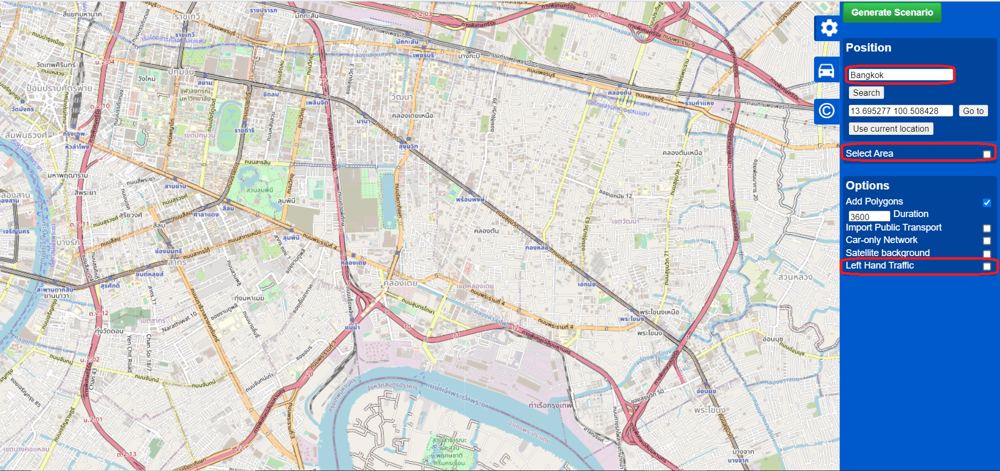
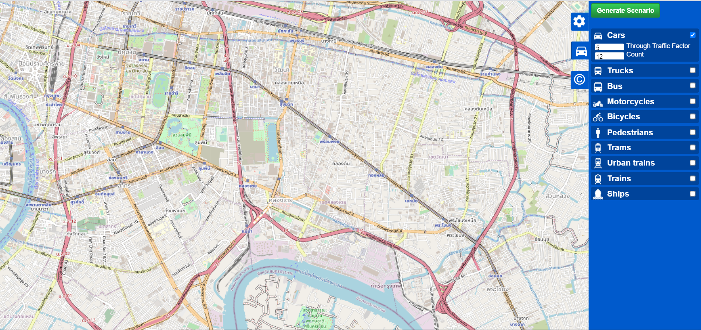
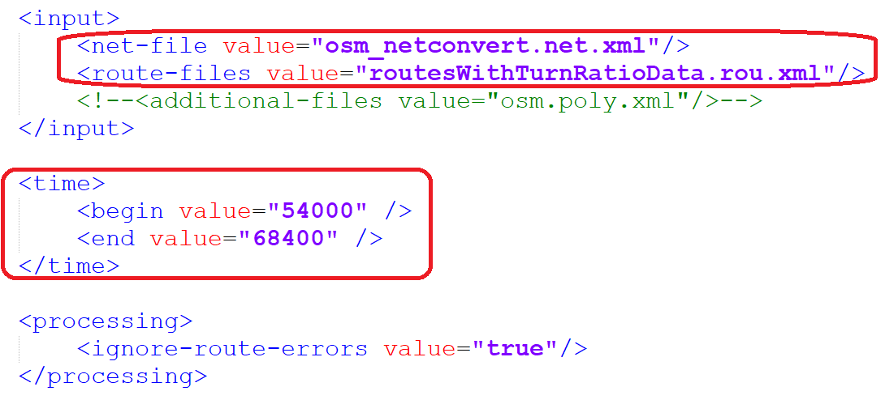
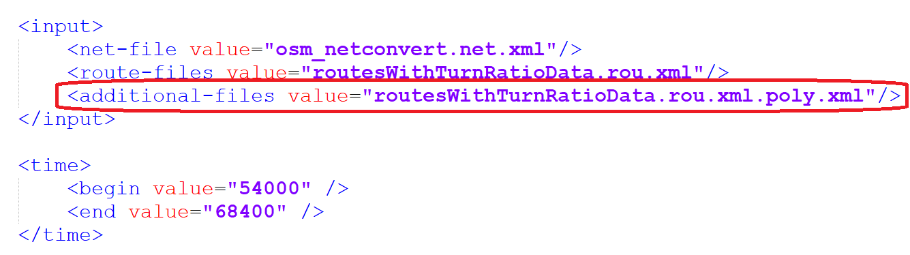
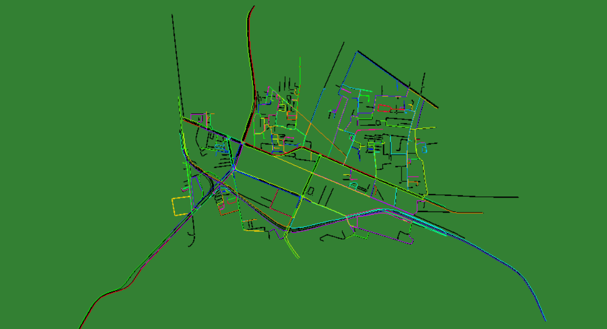

# Dynamic Traffic Assignment Using Open Street Map and Simulation of Urban MObility</strong>

Generate network topology
=============================================================================
To generate the network topology of our point of interest area, we can use OSMWebWizard. Users can invoke the OSMWebWizard by clicking **"%SUMO_HOME%\tools\osmWebWizard.py"**. Once the script is running, a web browser will open showing a map excerpt of central Berlin. Users can type any city name that you want. User can type traffic demand for any traffic mode that you want.

The generated folder is with the name of **"yyyy-mm-dd-hh-mm-ss"**. For more detail : https://sumo.dlr.de/docs/Tutorials/OSMWebWizard.html.

Remove edges using netconvert
=============================================================================
Users can remove all edges which can not be used by passenger vehicles. Here, if your road network is with  left-hand drive, please use **--lefthand** option for every time that you convert the network. 

**netconvert --sumo-net-file osm.net.xml --lefthand --remove-edges.by-vclass hov,taxi,bus,delivery,transport,lightrail,cityrail,rail_slow,rail_fast,motorcycle,bicycle,pedestrian -o osm_netconvert.net.xml**

For more detail : https://sumo.dlr.de/docs/Networks/Import/OpenStreetMap.html#dismissing_unwanted_traffic_modes

Reduce network using netconvert
=============================================================================
Users can also reduce the network size with the following options. 

**netconvert --sumo-net-file osm.net.xml --lefthand --no-internal-links --keep-edges.by-vclass passenger --remove-edges.by-type highway.track,highway.services,highway.unsurfaced -o osm_netconvert.net.xml**

Generate routes using randomTrips in build.bat file
=============================================================================
**python "%SUMO_HOME%\tools\randomTrips.py" -n osm_netconvert.net.xml --seed 42 --fringe-factor 300 -p 0.253626 -o osm.passenger.trips.xml -e 3600 --vehicle-class passenger --vclass passenger --prefix veh --min-distance 300 --trip-attributes "departLane=\"best\"" --fringe-start-attributes "departSpeed=\"max\"" --allow-fringe.min-length 1000 --lanes --validate**

Here, input net file is osm_netconvert.net.xml that is converted by using netconvert. The option **--fringe-factor** is used to increase the probability that trips will start/end at the fringe (boundary) of the network. Output files are routes.rou.xml and routes.rou.alt.xml. For more detail : https://sumo.dlr.de/docs/Tools/Trip.html#randomtripspy and https://sumo.dlr.de/docs/Tools/Trip.html#edge_probabilities.

Remove common routes
=============================================================================
If users want to reduce some routes that are duplicated, users can use **remove_commonRoutes.py**. Input file is the generated route file from randomTrips.py.
Output file is **removeCommonRoutes.rou.xml**. Users can run by clicking **removeCommonRoutes.bat** file.

Sampling using routeSampler
=============================================================================
The routeSampler script can generate routes from turn-count data, edge-count and even origin-destination-count data. It requires a route file as input that defines possible routes. Here, we use turn ratio data from BMA. Turn ratio data file is **turn3_modified_31122020.xml**. Turn ratio data has about 4 hours data from 3PM to 7PM for all intersections in the Kasemrat area. The output file is **routesWithTurnRatioData.rou.xml**.

**python "%SUMO_HOME%\tools\routeSampler.py" -r removeCommonRoutes.rou.xml --turn-files turn3_modified_31122020.xml -o routesWithTurnRatioData.rou.xml**

For more detail : https://sumo.dlr.de/docs/Tools/Turns.html#routesamplerpy

Setting in osm.sumoconfig
=============================================================================
Users need to change route file, net file and time setting in osm.sumoconfig file as shown in the following figure.

run.bat
=============================================================================
Now, users can run by clicking run.bat file.

Transform routes into polygons for visualization
=============================================================================
The input of route2poly.py python program is netfile and route file as shown below. The output file is **routesWithTurnRatioData.rou.xml.poly.xml**.
This output file is the additional input in sumocfg file. 

**python "%SUMO_HOME%\tools\route\route2poly.py" osm_netconvert.net.xml routesWithTurnRatioData.rou.xml**

For more detail : https://sumo.dlr.de/docs/Tools/Routes.html#route2polypy
